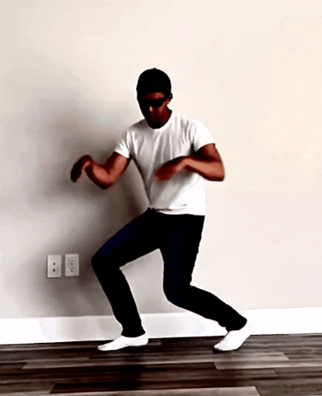
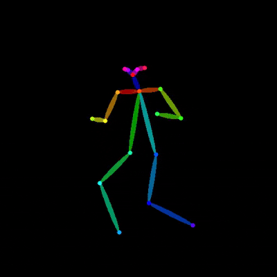
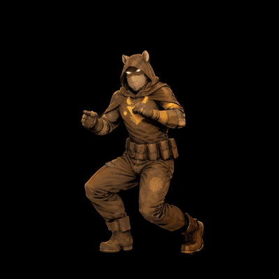
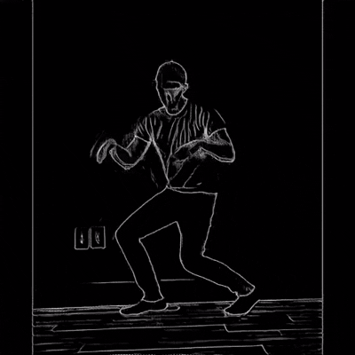
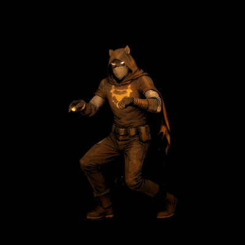

# AI Choreography-to-Animation Pipeline

Convert a video of real human movement into a stylized AI-generated animation — automatically, end to end, with no per-frame manual input.

Built as a UCF Senior Design project using AnimateDiff, ControlNet, a custom-trained LoRA character model, and BiRefNet background removal.

---


## Pipeline Results


<table align="center">
  <tr>
    <th align="center">Input Video</th>
    <th align="center">Pose Skeleton</th>
    <th align="center">Output (No Lineart)</th>
  </tr>
  <tr>
    <td></td>
    <td></td>
    <td></td>
  </tr>
  <tr>
    <td colspan="3" align="center">
      <b>Source Script:</b> <code>image_gen.py</code>
    </td>
  </tr>
</table>  
<table align="center">
  <tr>
    <th align="center">Input Video</th>
    <th align="center">Pose Skeleton</th>
    <th align="center">Lineart Outline</th>
    <th align="center">Output (With Lineart)</th>
  </tr>
  <tr>
    <td></td>
    <td></td>
    <td></td>
    <td></td>
  </tr>
  <tr>
    <td colspan="4" align="center">
      <b>Source Script:</b> <code>image_gen_with_lineart.py</code>
    </td>
  </tr>
</table>


## How It Works

The pipeline runs in 5 sequential stages:

```
Input Video
    │
    ▼
[1] FFmpeg — Frame Extraction & Preprocessing
    Extract frames, correct aspect ratio,
    add zero-padding bars if needed, LANCZOS resize to 768×768
    │
    ▼
[2] OpenPose — Skeletal Pose Detection
    Run lllyasviel/ControlNet OpenPose detector
    on each frame to extract body keypoints
    │
    ▼
[3] AnimateDiff + ControlNet — Chunk Inference
    Feed pose frames into AnimateDiffControlNetPipeline
    in chunks of 16 frames to fit within 16GB VRAM.
    Custom LoRA fused into pipeline for character identity.
    (Optional: use Lineart version for a different visual style)
    │
    ▼
[4] BiRefNet — Background Removal
    High-precision segmentation with alpha matting
    to cleanly isolate the character on a black background
    │
    ▼
[5] Upscale Pass
    LANCZOS upscale from 768×768 to 2048×2048
    with high-quality resampling
    │
    ▼
Output Animation (MP4 @ 24fps)
```

---

## Project Structure

```
/
├── image_gen.py                        # Stage 3: AnimateDiff + ControlNet (OpenPose only)
├── image_gen_lineart.py                # Stage 3: AnimateDiff + ControlNet + Lineart
├── lineart.py                          # Lineart frame extraction helper
├── upscaler.py                         # Stage 5: LANCZOS batch upscale to 2048×2048
├── background_remover.py               # Stage 4: BiRefNet background removal
│
├── FFmpeg/
│   ├── FFmpeg_video_to_frames.py       # Stage 1: Frame extraction + preprocessing
│   └── FFmpeg_frames_to_video.py       # Final: Stitch frames back to MP4 @ 24fps
│
├── Openpose/
│   └── Openpose.py                     # Stage 2: Pose detection, saves pose_frame_XXXX.png
│
├── train/
│   ├── run_BLIP_caption.py             # Auto-caption training images via BLIP
│   └── run_train.py                    # Launch LoRA training via kohya_ss
│
├── FFmpeg/FFmpeg Images/               # Stage 1 output: extracted source frames
├── Openpose/results/                   # Stage 2 output: pose skeleton frames
├── lineart_frames/                     # Lineart output (if using image_gen_lineart.py)
├── generated_frames/                   # Stage 3 output: AI-generated frames
├── black_bg_frames/                    # Stage 4 output: background-removed frames
├── videos/
│   ├── input.mp4                       # Your input video goes here
│   └── output.mp4                      # Final rendered video
│
└── img/
    └── 5_ratman/                       # Training images + auto-generated .txt captions
```

---

## Requirements

### Hardware
- NVIDIA GPU with **16GB+ VRAM** (tested on RTX 5070 Ti)
- CUDA 12.x

### External Dependencies
- [FFmpeg](https://ffmpeg.org/download.html) — must be installed and on `PATH`
- [kohya_ss sd-scripts](https://github.com/kohya-ss/sd-scripts) — cloned to `sd-scripts/` for LoRA training

### Python Packages
```bash
pip install torch torchvision --index-url https://download.pytorch.org/whl/cu121
pip install diffusers transformers accelerate controlnet-aux
pip install rembg imageio-ffmpeg pillow
```

### Model Files *(not included — download separately)*
| File | Purpose |
|---|---|
| `M4RV3LSDUNGEONSNEWV40COMICS_mD40.safetensors` | Base Stable Diffusion checkpoint |
| `Ratman_v1.safetensors` | Custom character LoRA (output of `run_train.py`) |
| `easynegative.safetensors` | Negative textual inversion embedding |
| `verybadimagenegative_v1.3.pt` | Negative textual inversion embedding |

---

## Usage

### Step 1 — Train Your Character LoRA

If you want to use a custom character, place your training images in `img/your_character/` then run BLIP captioning to auto-generate `.txt` caption files:

```bash
python train/run_BLIP_caption.py
```

A `ratman, ` trigger-word prefix is prepended to every caption automatically. Update the `PREFIX` and `IMAGE_FOLDER` variables in `run_BLIP_caption.py` for your own character.

Then launch LoRA training:

```bash
python train/run_train.py
```

Output: `model/Ratman_v1.safetensors`

---

### Step 2 — Prepare Your Input Video

Place your video at `FFmpeg/videos/input.mp4`, then extract and preprocess frames:

```python
from FFmpeg.FFmpeg_video_to_frames import get_frames
get_frames("FFmpeg/videos/input.mp4")
```

Then run OpenPose to extract body keypoints from each frame:

```python
from Openpose.Openpose import run_openpose
run_openpose()
```

Pose frames are saved to `Openpose/results/`.

---

### Step 3 — Run the Main Generation Pipeline

**OpenPose-only (standard):**
```bash
python image_gen.py
```

**OpenPose + Lineart (alternate style):**
```bash
python image_gen_lineart.py
```

Both run AnimateDiff + ControlNet inference in chunks of 16 frames, saving output to `generated_frames/`. The Lineart variant additionally runs `lineart.py` to extract edge maps and feeds them as a second conditioning signal.

---

### Step 4 — Background Removal *(optional)*

```bash
python background_remover.py
```

Runs BiRefNet (`birefnet-general`) with alpha matting and `post_process_mask`. Output frames are composited onto a black background and saved to `black_bg_frames/`, then automatically stitched to video.

---

### Step 5 — Upscale Pass

```bash
python upscaler.py
```

Batch-upscales all frames to 2048×2048 using LANCZOS resampling (saved at 95% JPEG quality). Output frames are saved to `upscaled_frames/` and stitched to a final MP4.

---

## Key Technical Details

**16-frame chunking** — AnimateDiff generates temporally consistent motion within a chunk of 16 frames. Processing in fixed 16-frame windows is required to stay within 16GB VRAM while maintaining motion coherence across the sequence.

**VAE slicing and tiling** — Enabled on the VAE decoder to handle 768×768 generation resolutions without out-of-memory errors on consumer GPUs.

**LoRA fusion** — The character LoRA is fused into the pipeline weights before inference (`pipe.fuse_lora()`) rather than applied at runtime. This improves inference speed and ensures consistent character identity across all chunks without per-chunk re-application.

**BLIP captioning** — Instead of writing training captions by hand, `run_BLIP_caption.py` uses `Salesforce/blip-image-captioning-base` to auto-generate a natural language description for every training image. A fixed trigger-word prefix is prepended so the character token appears in every caption.

**VRAM cleanup** — `clear_vram()` (gc + `torch.cuda.empty_cache()` + `torch.cuda.ipc_collect()`) is called between pipeline stages to free fragmented memory before loading the next model.

---

## Output Summary

| Stage | Script | Resolution | Notes |
|---|---|---|---|
| Frame Extraction | `FFmpeg_video_to_frames.py` | Source → 768×768 | LANCZOS resize, zero-bar padding |
| Pose Detection | `Openpose.py` | 768×768 | lllyasviel/ControlNet |
| Generation | `image_gen.py` | 768×768 | 16 frames/chunk |
| Generation (Lineart) | `image_gen_lineart.py` | 768×768 | 16 frames/chunk + lineart conditioning |
| Background Removal | `background_remover.py` | 768×768 | BiRefNet + alpha matting |
| Upscale | `upscaler.py` | 2048×2048 | LANCZOS, 95% quality |
| Final Video | `FFmpeg_frames_to_video.py` | 2048×2048 | 24fps, H.264, yuv420p |

---

## The Character Model — Custom LoRA Training

The example character (Ratman) is a custom LoRA trained from scratch for this pipeline.

| Parameter | Value |
|---|---|
| Dataset | 53 hand-curated character images |
| Captioning | Automated via BLIP (`Salesforce/blip-image-captioning-base`) |
| Base model | `runwayml/stable-diffusion-v1-5` |
| Training script | `kohya_ss` — `train_network.py` |
| Optimizer | AdamW8bit |
| LR Scheduler | Cosine |
| Mixed precision | fp16 |
| Network dim / alpha | 64 / 32 |
| Resolution | 768×768 with bucket sizing |
| Epochs | 10 |

---

## Built With

- [Diffusers](https://github.com/huggingface/diffusers) — AnimateDiff, ControlNet, pipeline orchestration
- [kohya_ss sd-scripts](https://github.com/kohya-ss/sd-scripts) — LoRA training
- [BLIP](https://huggingface.co/Salesforce/blip-image-captioning-base) — automated image captioning
- [ControlNet OpenPose](https://huggingface.co/lllyasviel/control_v11p_sd15_openpose) — skeleton detection
- [ControlNet Lineart](https://huggingface.co/lllyasviel/Annotators) — lineart edge detection
- [BiRefNet](https://github.com/ZhengPeng7/BiRefNet) via rembg — background removal
- [FFmpeg](https://ffmpeg.org) — frame extraction and video assembly

---

## Author

**Ethan Tsillas**  
[github.com/EthanTsillas](https://github.com/EthanTsillas)  
[linkedin.com/in/ethan-tsillas](https://www.linkedin.com/in/ethan-tsillas-857346399/)
